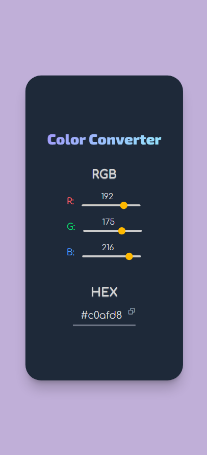
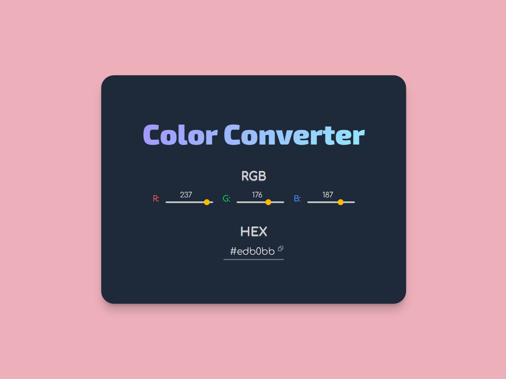

# Color Converter

## Overview

A simple but functional color converter.

### Features

- Input RGB values by typing or sliding bars
- Input HEX value by typing
- Convert RGB to HEX
- Convert HEX to RGB
- Change background color based on RGB/HEX values
- Copy HEX value to the clipboard
- Responsive design

### Built With

- ReactJS
- Tailwind CSS

---

## Screenshots

Responsive Design

  
  

 

Copy HEX value

